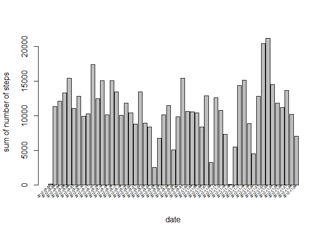
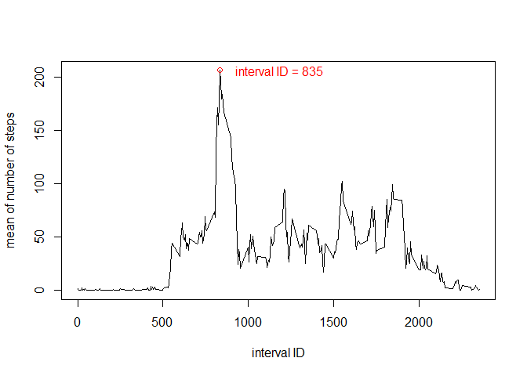
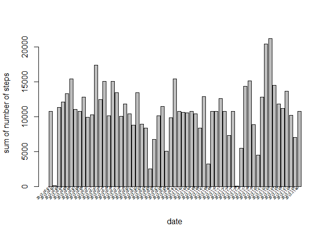
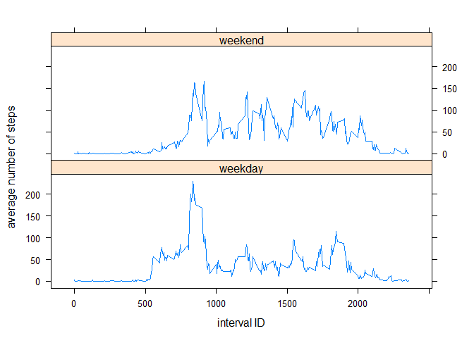

# Reproducible Research: Peer Assessment 1


## Loading and preprocessing the data


```r
unzip("activity.zip")
activityData <- read.csv("activity.csv")
activityData$date <- as.Date(activityData$date,"%Y-%m-%d")
naRemovedActivityData <- activityData[!is.na(activityData$steps),]
```

## What is mean total number of steps taken per day?


```r
sumsOfDays <- aggregate(naRemovedActivityData[,1],by=list(naRemovedActivityData$date),FUN=sum)
x<-barplot(sumsOfDays$x,xlab="date",ylab= "sum of number of steps")
text(cex=.45, x=x+1, y=+1, sumsOfDays$Group.1, xpd=TRUE, srt=45, pos=2)
```

<!-- -->

Mean of the sum of the steps taken each day is: 

```r
mean(sumsOfDays$x)
```

```
## [1] 10766.19
```
Median of the sum of the steps taken each day is: 

```r
median(sumsOfDays$x)
```

```
## [1] 10765
```
## What is the average daily activity pattern?


```r
meanOfIntervals <- aggregate(naRemovedActivityData[,1],by=list(naRemovedActivityData$interval),FUN=mean)
xOfMax <- meanOfIntervals[meanOfIntervals$x==max(meanOfIntervals$x),1]
with(meanOfIntervals,plot(Group.1,x,type="l",xlab="interval ID",ylab= "mean of number of steps"))
points(xOfMax,max(meanOfIntervals$x),col="red")
text(xOfMax+350,max(meanOfIntervals$x),col="red",labels=c(paste0("interval ID = ", xOfMax)))
```

<!-- -->
The maximum number of steps taken on average across all days is the interval with the ID:

```r
meanOfIntervals[meanOfIntervals$x==max(meanOfIntervals$x),1]
```

```
## [1] 835
```

## Imputing missing values

Number of null values in the data is:

```r
sum(is.na(activityData$steps))
```

```
## [1] 2304
```
And null values only appear in the steps column. Number of null values in the other two columns:

```r
sum(is.na(activityData$date))
```

```
## [1] 0
```

```r
sum(is.na(activityData$interval))
```

```
## [1] 0
```
If a null value appears in a day, steps column of all the rows for that day is also null:

```r
sum(is.na(activityData[activityData$date %in% activityData$date[is.na(activityData$steps)],]$steps))==sum(is.na(activityData$steps))
```

```
## [1] TRUE
```
Therefor I imput the null values using the means of the corresponding interval:

```r
for (myDate in unique(activityData$date[is.na(activityData$steps)])) {
activityData$steps[is.na(activityData$steps)] <- meanOfIntervals$x[meanOfIntervals$Group.1==activityData$interval[is.na(activityData$steps)]]
}
```

Histogram of total number of steps taken per day after imputing missing values:


```r
sumsOfDays2 <- aggregate(activityData[,1],by=list(activityData$date),FUN=sum)
x<-barplot(sumsOfDays2$x,xlab="date",ylab= "sum of number of steps")
text(cex=.45, x=x+1, y=+1, sumsOfDays2$Group.1, xpd=TRUE, srt=45, pos=2)
```

<!-- -->

Mean of the sum of the steps taken each day after imputing missing values is: 

```r
mean(sumsOfDays2$x)
```

```
## [1] 10766.19
```
Median of the sum of the steps taken each day after imputing missing values is: 

```r
median(sumsOfDays2$x)
```

```
## [1] 10766.19
```

## Are there differences in activity patterns between weekdays and weekends?

```r
Sys.setlocale("LC_ALL","English")
```

```
## [1] "LC_COLLATE=English_United States.1252;LC_CTYPE=English_United States.1252;LC_MONETARY=English_United States.1252;LC_NUMERIC=C;LC_TIME=English_United States.1252"
```

```r
activityDataWeekday <- cbind(activityData,isWeekday=ifelse(weekdays(activityData$date)%in%c("Saturday","Sunday"),"weekend","weekday"))

meanOfIntervalsWeekday <- aggregate(activityDataWeekday[,1],by=list(activityDataWeekday$interval,activityDataWeekday$isWeekday),FUN=mean)
names(meanOfIntervalsWeekday) <- c("interval","isWeekday","meanOfInterval")
library(lattice)
xyplot(meanOfInterval~interval|isWeekday,meanOfIntervalsWeekday,type='l',xlab = "interval ID",ylab = "average number of steps",layout=c(1,2))
```

<!-- -->
